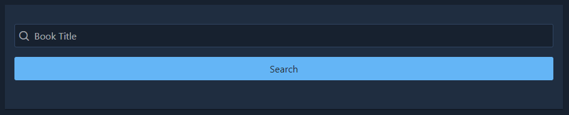

# Angular Google Book Search  

Angular version of my google books API application.  

### Purpose  

Find your favorite books on Google Books API and save them for later!  

### How to use  

The Home page of this app links to the two other pages.  

>

The user can either search for new books on the Search page or look through their saved books on the Saved page.  
  
On the Search page, the user can search for books by title.  
Any books that match the query, will appear below the form after clicking the search button.  

>  

On any page, the user can navigate to another page using the drawer on the left side of the page.  

>

### Deployment  

> http://ec2-18-217-195-239.us-east-2.compute.amazonaws.com/

### Technologies  

> Angular, PrimeNG, Node.js, Express.js, MongoDB, Mongoose, AWS, Ubuntu  

Front-end: Angular, PrimeNG  
Back-end: Node.js, Express.js  
Database: MongoDB, Mongoose  
Deployment: AWS, Ubuntu  